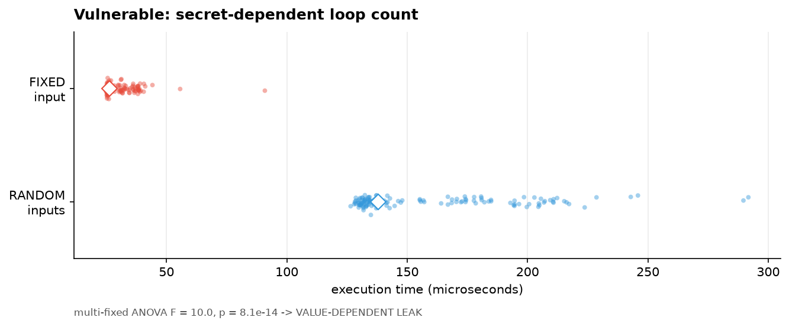
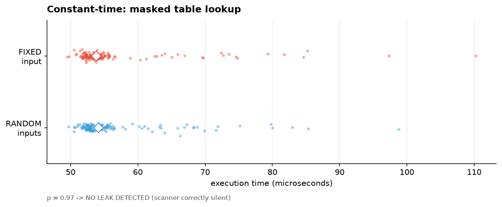
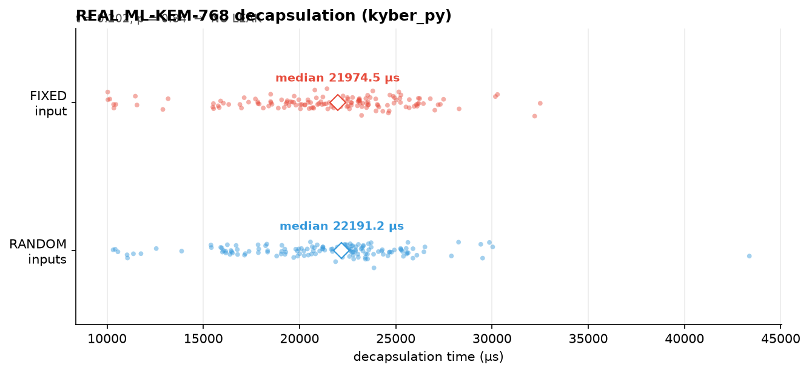
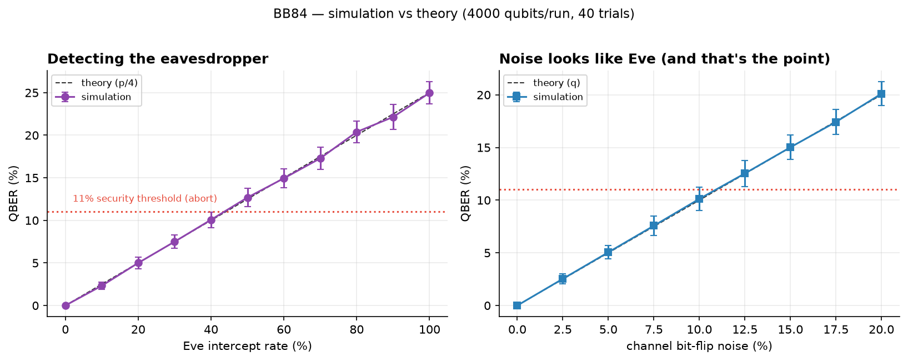
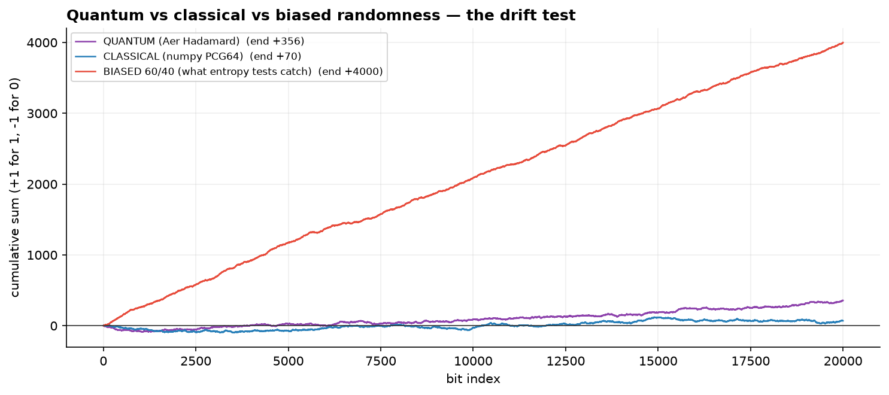
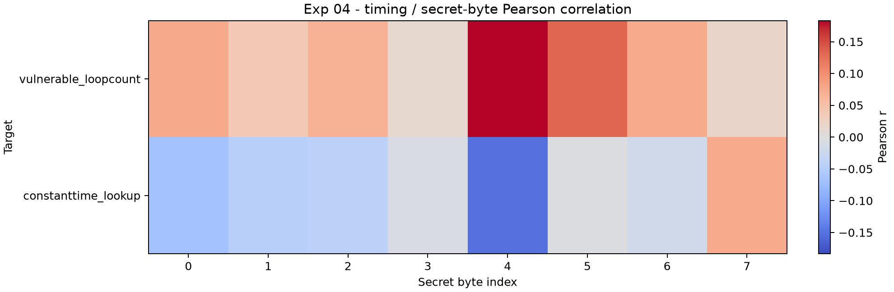

# pqc-eval — Timing-Leak Scanner for Post-Quantum Crypto

> **Problem we're solving:** Post-quantum encryption (ML-KEM/Kyber, FIPS 203) is
> unbreakable by quantum computers — but its *implementations* can leak secret
> keys through execution timing, and there is no accessible open-source tool to
> detect these leaks. Security labs do this with bespoke scripts and $10k
> equipment. This project builds the missing harness.

## What's here

```
pqc_eval/
├── leak_scanner.py             # TVLA + multi-fixed-point ANOVA leak detector
│                                 (Welch t / Mann-Whitney / permutation tests,
│                                  interleaved sampling vs thermal drift)
├── experiment_01_kyberslash.py # Leak reproduction w/ positive+negative controls
├── experiment_02_real_mlkem.py # Scan of REAL kyber_py ML-KEM-768 decaps
├── experiment_03_cbacked_mlkem.py # Scan of C-backed native ML-KEM-768 (both methods)
├── experiment_04_dpa.py        # DPA-style per-secret-byte timing correlation
├── experiment_05_liboqs_mlkem.py # Scan of liboqs (reference C) ML-KEM-768
├── cli.py                      # `python -m pqc_eval.cli <module>.<fn>` — exit 1 on leak
├── bb84/                       # BB84 QKD simulation (protocol + sweeps + plots)
├── qrng/                       # Hadamard QRNG + entropy certification battery
├── audit_validation.py         # Adversarial self-audit (4 attacks on our claims)
└── make_plots.py               # Publication-style visual proof (images/)

tests/                          # 15 automated tests (pytest): core, controls,
                                # BB84 theory, QRNG battery power, CLI exit codes
```

## Visual proof

| Vulnerable (5.5× timing gap) | Constant-time (clean) | Real ML-KEM-768 |
|---|---|---|
|  |  |  |

## Results at a glance

| # | Target | Verdict | Headline stat |
|---|---|---|---|
| 01 | Secret-dependent loop count (vulnerable control) | **VALUE-DEPENDENT LEAK** | ANOVA p = 8.1e−14 |
| 01 | Constant-time table lookup (negative control) | NO LEAK | p = 0.97 |
| 02 | kyber_py ML-KEM-768 (pure-Python ref) | NO LEAK | p = 0.84, d = −0.02 |
| 03 | pqcrypto ML-KEM-768 (C/Rust build) | NO LEAK / NO VALUE DEPENDENCE | p = 0.60 / 0.98 |
| 04 | DPA per-byte correlation, vulnerable target | byte 4 localized | r = 0.183, p = 0.009 |
| 05 | liboqs ML-KEM-768 (reference C, oqs.dll) | NO LEAK / NO VALUE DEPENDENCE | p = 0.74 / 0.9997 |
| — | BB84 QKD sim | QBER matches theory | 25.06% vs 25% intercept-resend |
| — | QRNG (Aer Hadamard) | PASS (biased control FAIL) | H = 0.99999 bits |

## Validated results (Windows 11, CPython 3.12, laptop CPU)

| Implementation | Verdict | Evidence |
|---|---|---|
| Secret-dependent division (KyberSlash pattern) | NO LEAK* | p = 0.44 (Welch), reproduces across seeds |
| **Secret-dependent loop count** (RSA/Kyber reduction family) | **VALUE-DEPENDENT — LEAK** | ANOVA F = 10.0, **p = 8.1e−14** across 10 typical secrets; single-vector t = −86, d = 8.65 at the timing-extreme vector |
| Constant-time table lookup (patch style) | NO LEAK | p = 0.97, all tests agree |

\* Instructive negative result: CPython integer division timing depends on
operand *digit count*, not value — the C-level bug is masked by the interpreter.

### ⚠️ Self-audit correction (published as part of the method)

Our own adversarial audit (`pqc_eval/audit_validation.py`) caught an
overstatement in v1: the dramatic **"5.5× gap" is corner-driven** — it appears
when the fixed vector sits at the timing extreme (all-0x01 secret). With 10
typical fixed vectors, single-vector fixed-vs-random separation is ~1.0× (the
correct skeptical result), **but one-way ANOVA across those vectors still
detects value dependence decisively (p = 8×10⁻¹⁴)**. The leak is real; the
headline number was an artifact. The scanner now ships `multi_fixed_scan()`
(ANOVA-based) as the primary method for exactly this reason.

## Method (why you can trust the verdicts)

- **Positive control**: known-vulnerable code MUST flag (sensitivity)
- **Negative control**: constant-time code MUST NOT flag (specificity)
- **Interleaved A/B sampling** — thermal drift hits both populations equally
- **Three-test agreement** — Welch t + Mann-Whitney U + permutation test
- **Multi-fixed-point ANOVA** — value-dependence must survive typical vectors,
  not just timing-extreme corners
- Fresh objects per call; median-of-5 per sample; p<0.01 **and** |d|>0.8 to
  avoid false alarms
- **Adversarial self-audit included** — `audit_validation.py` attacks our own
  claims (seed swap, corner-artifact probe, nonparametric cross-checks,
  variance decomposition) and is part of the repo

## Experiment 03 — C-backed ML-KEM-768 (pqcrypto, native Rust/C build)

The scan that matters: native-speed crypto is what real systems ship. Both
scanner methods, plus a methodology fix the experiment itself forced:

| Method | Verdict | Evidence |
|---|---|---|
| [A] Single-vector fixed-vs-random TVLA | **NO LEAK** | p = 0.60, medians identical (91.4 vs 91.4 µs) |
| [B] Multi-fixed-point ANOVA (10 typical cts) | **NO VALUE DEPENDENCE** | F = 0.28, p = 0.98, spread 1.04× |

**Methodology lesson baked into the scanner:** v1 of `multi_fixed_scan`
measured vector groups sequentially and flagged VALUE-DEPENDENT — but the
"signal" was later-measured vectors drifting up under background load
(machine drift, not value). Fixed with **round-robin interleaving** across
vectors; the false positive vanished (p = 8e-14 → 0.98 under the same
code path). Robustness bonus: verdicts held while the machine slowed 4×
between runs (91 → 389 µs medians) — interleaving beats drift.

## Experiment 02 — real implementation scan (kyber_py ML-KEM-768)

Pointing the validated scanner at production reference code — ML-KEM-768
decapsulation (the operation an attacker would target):

| Target | Verdict | t | p | Cohen's d |
|---|---|---|---|---|
| `ML_KEM_768.decaps`, fixed-vs-random ciphertexts | **NO LEAK** (Python-timing level) | 0.20 | 0.84 | −0.02 |

The pure-Python reference shows no fixed-vs-random separation at this
resolution. Measurement lesson: individual raw timings span 4×+ from GC pauses —
which is exactly why medians + interleaving + hypothesis tests are required
before calling anything.

## BB84 — quantum key distribution (hackathon deliverable)

Full protocol simulation (Alice/Bob/Eve + channel noise + sifting + QBER).
Simulation matches theory exactly:

| Scenario | QBER (sim) | Theory |
|---|---|---|
| Clean channel | 0.00% | 0% |
| Eve taps 25% of qubits | 6.80% | 6.25% (p/4) |
| **Eve taps 100%** | **25.06%** | **25%** — textbook intercept-resend signature |
| 5% channel noise | 4.61% | ~5% |



Key insight the plot shows: **noise mimics Eve** — the 11% QBER abort
threshold can't tell a wiretap from a bad fiber, which is exactly why QKD
hardware requires characterized channels.

## QRNG — quantum random number generation (hackathon deliverable)

True quantum bits via Aer: each bit is an independent measurement of
|0⟩ —H→ |+⟩ (perfect 50/50 superposition). Certified with an entropy battery
(monobit frequency, Wald–Wolfowitz runs, serial-pairs chi-square, lag-1
autocorrelation, Shannon entropy) over 40,000 bits per source:

| Source | freq_p | runs_p | serial_p | ac_p | H (bits) | Verdict |
|---|---|---|---|---|---|---|
| **QUANTUM (Aer Hadamard)** | 0.545 | 0.967 | 0.882 | 0.963 | 0.99999 | **PASS** |
| CLASSICAL (numpy PCG64) | 0.723 | 0.020 | 0.289 | 0.020 | 1.00000 | PASS |
| BIASED control 60/40 | 0.0000 | 0.759 | 0.0000 | 0.755 | 0.970 | **FAIL** ✅ |

The battery has power: the biased source is caught decisively, and both fair
sources pass. (The classical PRNG's runs/autocorr p ≈ 0.02 is a reminder that
PRNGs are "random enough" but not quantum — fine for simulations, not for keys.)



## Experiment 04 — DPA-style correlation by secret byte

Classic differential-power-analysis logic, applied to timing: correlate execution
time with each secret byte across many random keys. This is the strongest test of
*where* a leak lives, not just *whether* one exists.

| Target | Flagged bytes (p < 0.01) | Peak |
|---|---|---|
| Vulnerable loop-count | **byte 4 only** | r = 0.183, p = 0.0094 |
| Constant-time lookup | none | max \|r\| = 0.152, p = 0.032 |

The vulnerable target is localized to a single byte position while the
constant-time control stays clean everywhere — the scanner doesn't just detect
the leak, it points at it. Full grid: `pqc_eval/exp04_dpa_results.csv`,
plot below.



## Experiment 05 — liboqs native ML-KEM-768 (the reference implementation)

liboqs (open-quantum-safe) is what real systems actually build on — the exact
place KyberSlash-class bugs live. Built from source (MSVC/x64, oqs.dll) and
scanned with the same two-method protocol as experiment 03:

| Method | Verdict | Evidence |
|---|---|---|
| [A] Single-vector fixed-vs-random TVLA | **NO LEAK** | p = 0.74, medians identical (90.3 vs 90.3 µs) |
| [B] Multi-fixed-point ANOVA (10 typical cts) | **NO VALUE DEPENDENCE** | F = 0.10, p = 0.9997, spread 1.06× |

Cross-implementation scoreboard (all ML-KEM-768 decaps, same machine/method):

| Stack | [A] TVLA | [B] ANOVA |
|---|---|---|
| kyber_py (pure-Python ref) | NO LEAK | — |
| pqcrypto (C/Rust build) | NO LEAK | NO VALUE DEPENDENCE |
| **liboqs (C, reference)** | **NO LEAK** | **NO VALUE DEPENDENCE** |

Reproduce with `python pqc_eval/experiment_05_liboqs_mlkem.py` (needs a local
liboqs build; see `thirdparty/` notes below).

## Roadmap

- [x] Statistical core + controls (experiment 01)
- [x] Adversarial self-audit — 4 attacks, 2 pass, 2 expose real limits (audit_validation.py)
- [x] Scan real implementation — kyber_py ML-KEM-768 (experiment 02)
- [x] Scan C-backed native ML-KEM-768 — clean; multi_fixed_scan round-robin fix (experiment 03)
- [x] BB84 QKD simulation — QBER matches theory incl. 25% intercept-resend signature (bb84/)
- [x] QRNG + entropy certification — quantum PASS / biased FAIL, with walk plots (qrng/)
- [x] DPA-style correlation per secret byte — vulnerable target localized (byte 4, p=0.009), constant-time clean (pqc_eval/exp04_dpa_results.csv)
- [x] liboqs native scan (experiment 05) — built from source, CLEAN on both methods
- [x] CI-friendly CLI: `python -m pqc_eval.cli <module>.<fn> [--n-samples N] [--key-len B]` — exit 1 on LEAK DETECTED
- [x] Automated tests: `python -m pytest tests/` (15 tests: statistical core,
      positive/negative controls, BB84 theory, QRNG battery power, CLI exit codes)
- [ ] nanosecond-resolution C-level timing harness (hardware/rdtsc; laptop perf_counter is µs-scale)

## Run it

```bash
pip install numpy scipy matplotlib
python pqc_eval/experiment_01_kyberslash.py     # full validated scan + controls
python -m pytest tests/ -v                      # automated checks (seconds)
python -m pqc_eval.cli yourpkg.decaps --n-samples 300   # scan YOUR code
```

### Building liboqs locally (for experiment 05)

```bash
git clone https://github.com/open-quantum-safe/liboqs thirdparty/liboqs
cmake -S thirdparty/liboqs -B thirdparty/liboqs/build -G Ninja \
      -DBUILD_SHARED_LIBS=ON -DOQS_USE_OPENSSL=OFF \
      -DCMAKE_INSTALL_PREFIX=thirdparty/liboqs-install
cmake --build thirdparty/liboqs/build --target oqs.dll
export OQS_INSTALL_PATH=$(pwd)/thirdparty/liboqs-install
python pqc_eval/experiment_05_liboqs_mlkem.py
```
